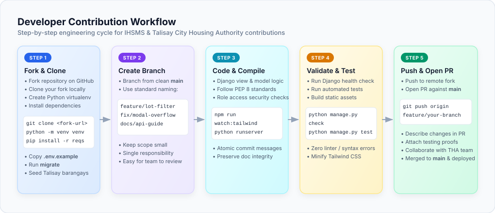
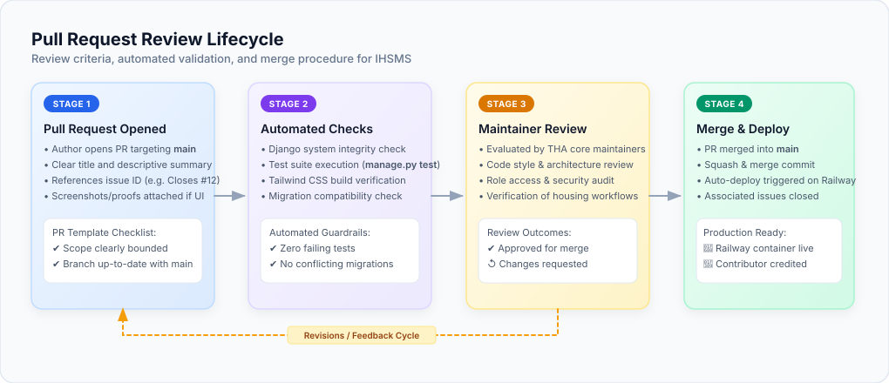

# 🤝 Contributing Guidelines

Thank you for your interest in contributing to the **Integrated Housing Services and Monitoring System (IHSMS)**! This document provides guidelines and best practices for submitting bug fixes, new features, and documentation improvements for the **Talisay City Housing Authority (THA)** platform.

---

## 📋 Table of Contents

- [Code of Conduct](#-code-of-conduct)
- [Getting Started](#-getting-started)
- [Development Workflow](#-development-workflow)
- [Coding Standards](#-coding-standards)
- [Submitting Pull Requests](#-submitting-pull-requests)

---

## 📜 Code of Conduct

We are committed to providing a welcoming, respectful, and collaborative environment for everyone. Please review and adhere to our [Contributor Code of Conduct](CODE_OF_CONDUCT.md). Ensure all interactions across issues, pull requests, and discussions remain professional, inclusive, and constructive.

---

## 🚀 Getting Started

### Prerequisites
- **Python 3.12+**
- **Git**
- **pip**
- **Node.js 18+ & npm** *(Required for compiling Tailwind CSS 4)*

### Local Development Setup

1. **Fork & Clone the Repository**:
   ```powershell
   git clone https://github.com/TheUnshackled1/capstone-talisay_housing.git
   cd capstone-talisay_housing
   ```

2. **Create & Activate Virtual Environment**:
   ```powershell
   python -m venv venv
   .\venv\Scripts\Activate
   ```

3. **Install Python Dependencies**:
   ```powershell
   pip install -r requirements.txt
   ```

4. **Install Frontend Tooling**:
   ```powershell
   npm install
   ```

5. **Configure Environment Variables**:
   Copy the reference `.env.example` file to create your local `.env`:
   ```powershell
   copy .env.example .env
   # or on bash/macOS/Linux:
   # cp .env.example .env
   ```
   *Note: Ensure `SECRET_KEY` and database configuration are appropriately set for your local environment.*

6. **Apply Database Migrations**:
   ```powershell
   python manage.py migrate
   ```

7. **Seed Reference Data**:
   Populate the initial Talisay City barangays and default document requirements:
   ```powershell
   python seed_requirements.py
   ```

8. **Run System Checks & Test Suite**:
   ```powershell
   python manage.py check
   python manage.py test
   ```

9. **Start the Development Server**:
   ```powershell
   python manage.py runserver
   ```
   The application will be accessible at [http://127.0.0.1:8000/](http://127.0.0.1:8000/).

10. *(Optional)* **Watch Tailwind CSS**:
    If you are modifying templates or styling classes, run the Tailwind CSS compiler in a separate terminal:
    ```powershell
    npm run watch:tailwind
    ```

---

## 🔄 Development Workflow


> ✏️ **Draw.io Source File:** [`docs/contribution_workflow.drawio`](docs/contribution_workflow.drawio) *(Editable in [Draw.io / app.diagrams.net](https://app.diagrams.net/))*

1. **Create a Feature Branch**:
   Create a dedicated branch for your work branching off `main`:
   ```powershell
   git checkout -b feature/your-feature-name
   # or for bug fixes:
   git checkout -b fix/issue-description
   ```

2. **Make Your Changes**:
   - Keep commits atomic, well-described, and focused on a single concern.
   - Follow standard commit message conventions (`feat: add barangay filter to applicants`, `fix: correct document upload validation`).

3. **Compile Static Assets** *(if editing styles)*:
   ```powershell
   npm run build:tailwind
   ```

4. **Verify System Health**:
   Ensure all checks and tests pass cleanly prior to committing:
   ```powershell
   python manage.py check
   python manage.py test
   ```

---

## 📐 Coding Standards

- **Python**: Follow [PEP 8](https://peps.python.org/pep-0008/) style conventions. Write clean Django views with strict control flow, defensive validation, and proper error handling.
- **Security & Authorization**:
  - Always enforce role decorators or mixins (`@login_required`, role-based access checks) on protected views.
  - Always include `` inside POST forms.
- **HTML / Templates**:
  - Use standard Django template inheritance extending `templates/base.html`.
  - Maintain semantic HTML tags with unique, descriptive IDs for key form and interactive elements.
- **Frontend / Styling**:
  - Utilize Tailwind CSS utility classes and the established glassmorphic theme tokens.
  - Avoid inline CSS styles (`style="..."`) where utility classes can be applied.
- **Database & Migrations**:
  - Never edit existing applied migration files directly if they have already been merged into `main`.
  - Always run `python manage.py makemigrations` to generate clean, incremental migration files.

---

## 📤 Submitting Pull Requests


> ✏️ **Draw.io Source File:** [`docs/pr_lifecycle.drawio`](docs/pr_lifecycle.drawio) *(Editable in [Draw.io / app.diagrams.net](https://app.diagrams.net/))*

1. Push your branch to your remote fork:
   ```powershell
   git push origin feature/your-feature-name
   ```
2. Open a **Pull Request (PR)** against the `main` branch of [capstone-talisay_housing](https://github.com/TheUnshackled1/capstone-talisay_housing).
3. Fill out the PR description with:
   - A concise summary of the changes introduced.
   - Context or issues referenced (e.g., `Closes #12`).
   - Testing steps performed to verify the implementation.
4. Address any feedback or requested adjustments during code review.
5. Once approved, maintainers will merge your pull request into `main` for automated deployment to Railway.

Thank you for contributing to the **Talisay City Housing Authority (THA)** and helping improve socialized housing delivery!
