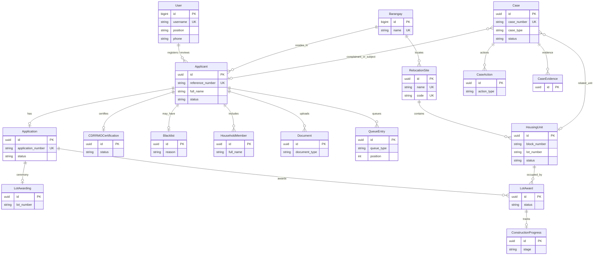
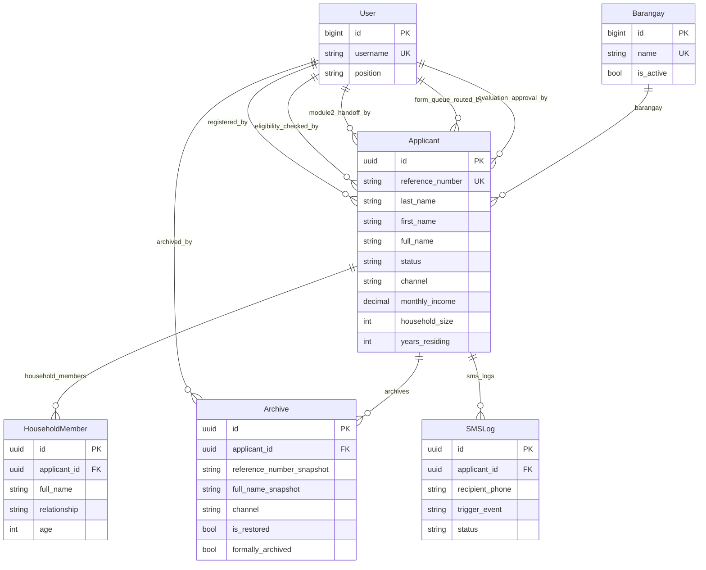
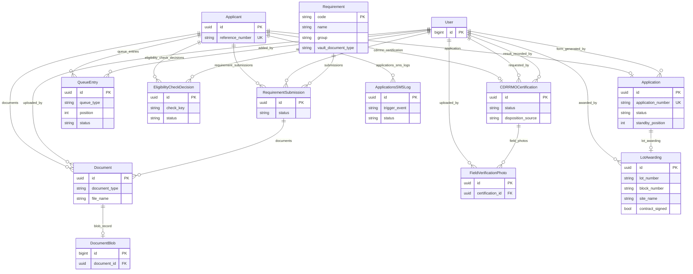
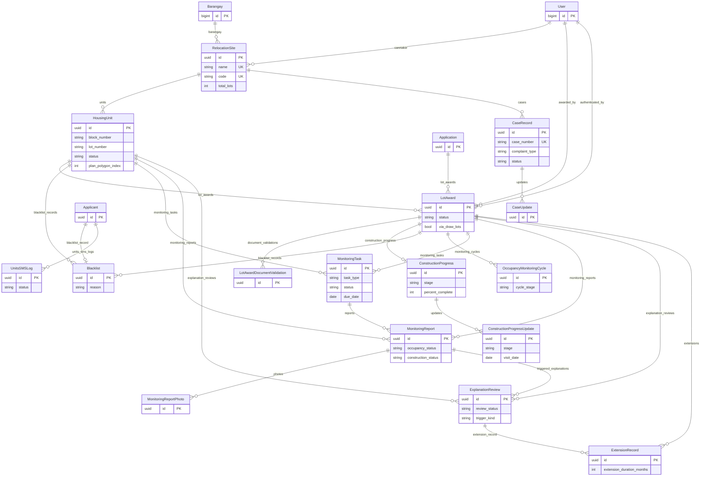
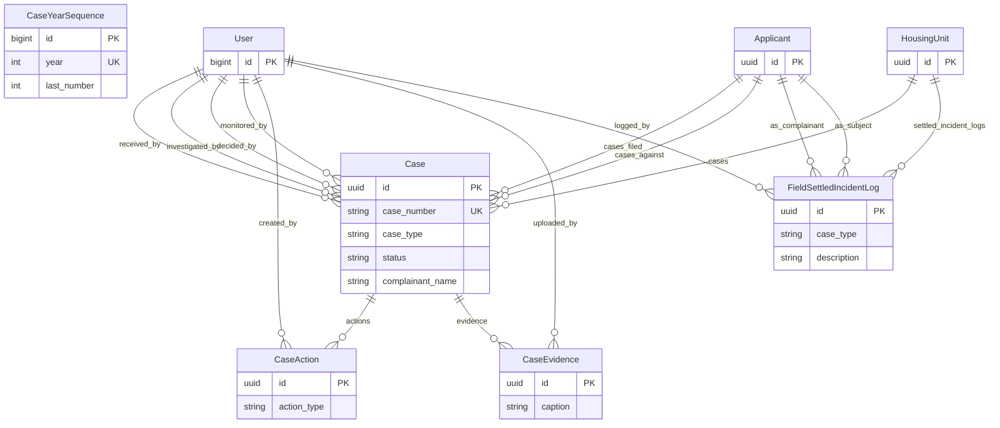

# IHSMS Entity Relationship Diagram

Codebase-accurate ERD from the Django models in `accounts`, `intake`, `applications`, `documents`, `units`, and `cases`.  
Generated from current `models.py` definitions (38 managed models). `dashboard` has no models.

**Draw.io (editable):** open [ERD.drawio](ERD.drawio) in [diagrams.net](https://app.diagrams.net/) or the VS Code/Cursor Draw.io extension.  
Pages: System Overview · Intake · Applications + Documents · Units · Cases.

**Cardinality legend (Crow’s foot):**

| Symbol | Meaning |
|--------|---------|
| `\|\|--\|\|` | Exactly one ↔ exactly one |
| `\|\|--o\|` | One ↔ zero-or-one |
| `\|\|--o{` | One ↔ zero-or-many |
| `}o--o\|` | Zero-or-many ↔ zero-or-one |
| `}o--\|\|` | Zero-or-many ↔ exactly one |

---

## 1. System overview

Hub entity: **`intake.Applicant`**. Staff actions hang off **`accounts.User`**. Housing awards bridge **`Application`** ↔ **`HousingUnit`** via **`LotAward`**. Formal cases live in **`cases.Case`**.

> Draw.io page: **1. System Overview** in [ERD.drawio](ERD.drawio)

---

## 2. Intake module (`intake`)

Models: `Barangay`, `Applicant`, `HouseholdMember`, `Archive`, `SMSLog`.

> Draw.io page: **2. Intake** in [ERD.drawio](ERD.drawio)

**Notes**

- `Applicant.barangay` uses `PROTECT` (barangay cannot be deleted while referenced).
- Check constraint: `years_residing <= 99`.

---

## 3. Applications + Documents

**Applications:** `Application`, `QueueEntry`, `CDRRMOCertification`, `FieldVerificationPhoto`, `EligibilityCheckDecision`, `SMSLog`.  
**Documents:** `Document`, `DocumentBlob`, `Requirement`, `RequirementSubmission`, `LotAwarding`.

Skip unmanaged `CDRRMOCertificationProxy` (same physical table as `CDRRMOCertification`).

> Draw.io page: **3. Applications + Documents** in [ERD.drawio](ERD.drawio)

**Notes**

- Unique `(applicant, check_key)` on `EligibilityCheckDecision`.
- Unique active `(queue_type, position)` on `QueueEntry`.
- Unique `(applicant, requirement)` on `RequirementSubmission`.
- Legacy tables: `Requirement` → `applications_requirement`; `RequirementSubmission` → `applications_requirementsubmission`.
- `LotAwarding` is the **ceremony / contract** 1:1 record on an application — distinct from `units.LotAward`.

---

## 4. Units module (`units`)

Housing inventory, lot awards, construction, occupancy monitoring, blacklist, and **legacy** case records.

> Draw.io page: **4. Units** in [ERD.drawio](ERD.drawio)

**Notes**

- Unique `(site, block_number, lot_number)` per housing unit.
- Unique `(site, plan_polygon_index)` when polygon index is set (lot-plan map overlay).
- `units.CaseRecord` / `CaseUpdate` are the **legacy** site-centric case tables; prefer `cases.Case` for new work.

---

## 5. Cases module (`cases`)

Formal case management (current workflow).

> Draw.io page: **5. Cases** in [ERD.drawio](ERD.drawio)

**Notes**

- `CaseYearSequence` supports yearly case-number allocation (`year` unique).
- `FieldSettledIncidentLog` records field-settled incidents **without** creating a formal `Case`.
- Complainant / subject / unit FKs on `Case` are optional (`SET_NULL`).

---

## 6. Schema gotchas

| Topic | Detail |
|-------|--------|
| **Hub** | `intake.Applicant` is the central beneficiary record. |
| **Two lot concepts** | `documents.LotAwarding` = 1:1 ceremony/contract on `Application`. `units.LotAward` = N awards linking `Application` ↔ `HousingUnit`. |
| **Two case systems** | `units.CaseRecord` (+ `CaseUpdate`) = legacy. `cases.Case` (+ actions/evidence) = current formal workflow. |
| **Three SMSLog tables** | `intake.SMSLog`, `applications.SMSLog`, `units.SMSLog` — same shape, separate tables / related names. |
| **Primary keys** | Most entities: UUID. Exceptions: `User` (bigint), `Barangay`, `CaseYearSequence`, `DocumentBlob` (implicit bigint), `Requirement.code` (string PK). |
| **No custom M2M** | Only inherited `User.groups` / `User.user_permissions` from Django auth. |
| **Unmanaged** | `CDRRMOCertificationProxy` maps to `applications_cdrrmocertification` — do not treat as a second entity. |
| **Staff FKs** | Many `User` FKs use `SET_NULL` so staff deletion does not cascade-delete domain data. |

---

## 7. Model checklist (38 managed)

| App | Models |
|-----|--------|
| **accounts** (1) | `User` |
| **intake** (5) | `SMSLog`, `Barangay`, `Applicant`, `HouseholdMember`, `Archive` |
| **applications** (6) | `Application`, `SMSLog`, `EligibilityCheckDecision`, `QueueEntry`, `CDRRMOCertification`, `FieldVerificationPhoto` |
| **documents** (5) | `Document`, `DocumentBlob`, `Requirement`, `RequirementSubmission`, `LotAwarding` |
| **units** (16) | `RelocationSite`, `HousingUnit`, `LotAward`, `LotAwardDocumentValidation`, `ConstructionProgress`, `ConstructionProgressUpdate`, `Blacklist`, `CaseRecord`, `CaseUpdate`, `SMSLog`, `OccupancyMonitoringCycle`, `MonitoringTask`, `MonitoringReport`, `MonitoringReportPhoto`, `ExplanationReview`, `ExtensionRecord` |
| **cases** (5) | `CaseYearSequence`, `Case`, `CaseAction`, `CaseEvidence`, `FieldSettledIncidentLog` |
| **dashboard** (0) | — |
