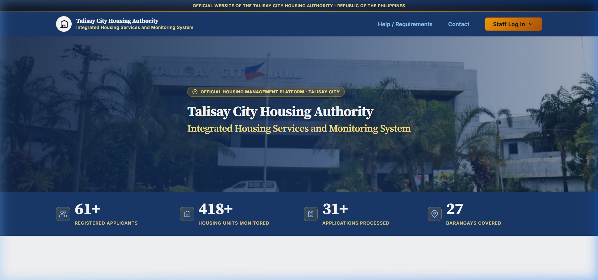
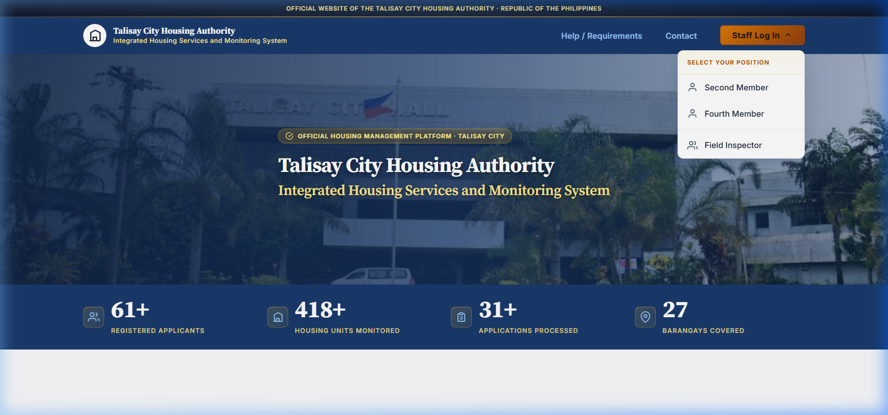
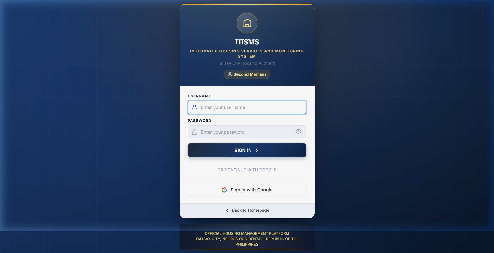
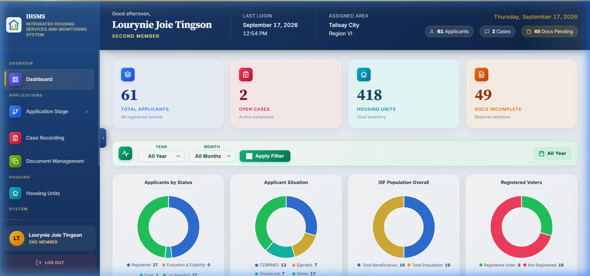
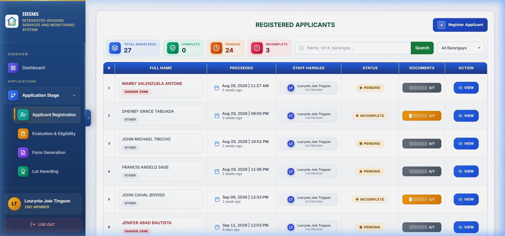
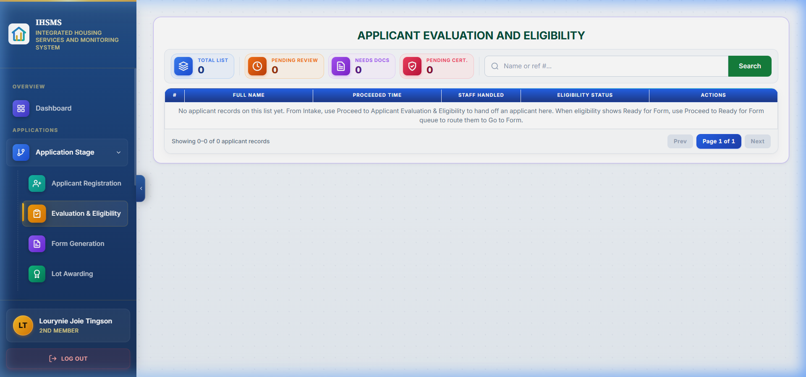
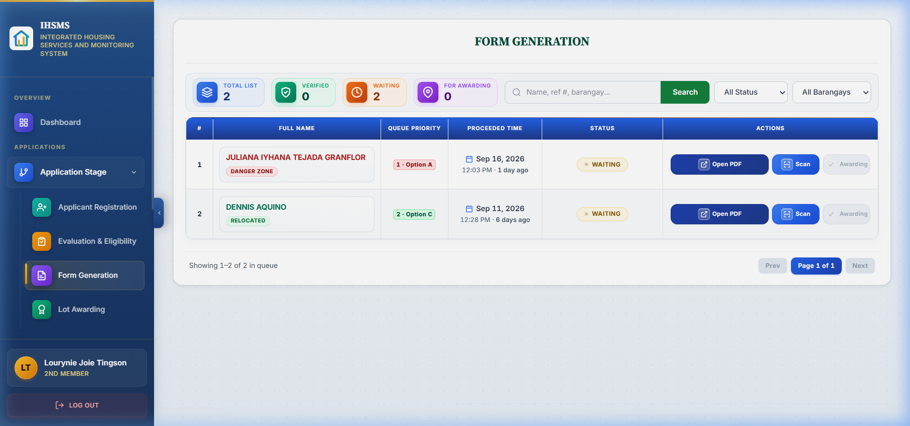
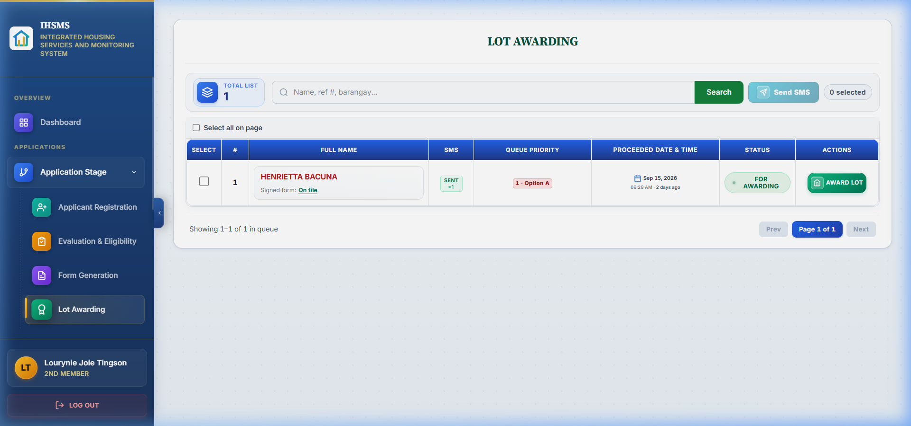
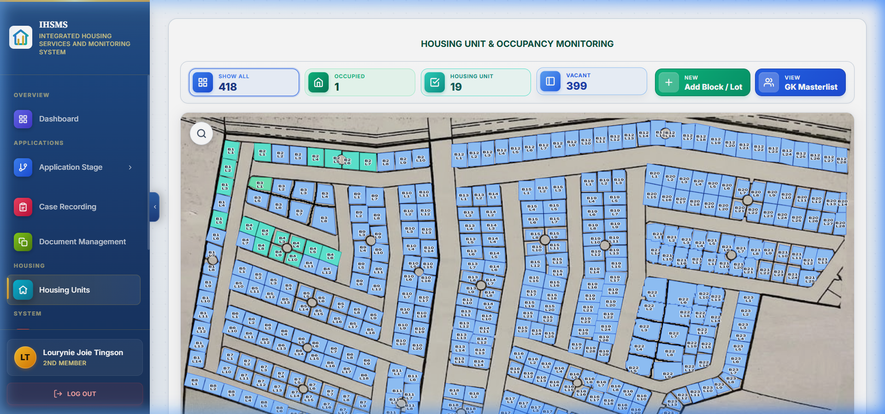

# IHSMS Staff User Guide
### Integrated Housing Services and Monitoring System
**Talisay City Housing Authority** · Talisay City, Negros Occidental

---

> This guide is intended for **Second Member** and **Fourth Member** staff of the Talisay City Housing Authority. It covers the complete workflow — from logging in to monitoring housing unit occupancy.

---

## Table of Contents

1. [Overview](#1-overview)
2. [Step 1 — Homepage](#2-step-1--homepage)
3. [Step 2 — Staff Login](#3-step-2--staff-login)
4. [Step 3 — Dashboard](#4-step-3--dashboard)
5. [Step 4 — Applicant Registration](#5-step-4--applicant-registration)
6. [Step 5 — Document Scanning](#6-step-5--document-scanning)
7. [Step 6 — Applicant Evaluation & Eligibility](#7-step-6--applicant-evaluation--eligibility)
8. [Step 7 — Form Generation](#8-step-7--form-generation)
9. [Step 8 — Lot Awarding & SMS Notification](#9-step-8--lot-awarding--sms-notification)
10. [Step 9 — Housing Unit & Occupancy Monitoring](#10-step-9--housing-unit--occupancy-monitoring)
11. [Frequently Asked Questions](#11-frequently-asked-questions)

---

## 1. Overview

The **IHSMS** (Integrated Housing Services and Monitoring System) is the official digital platform of the Talisay City Housing Authority. It manages the full lifecycle of housing applicants — from initial registration, document collection, eligibility evaluation, form generation, lot awarding, and finally housing unit monitoring.

### Workflow Summary

```
Homepage → Login → Dashboard → Register Applicant → Scan Documents
→ Evaluate Eligibility → Generate Form → Lot Awarding → Housing Monitoring
```

---

## 2. Step 1 — Homepage

**URL:** `https://ihsms.up.railway.app/`



The homepage is the public-facing landing page of the IHSMS system.

### What You Will See
- The **Talisay City Housing Authority** logo and system name at the top.
- Navigation links: **Help / Requirements** and **Contact**.
- A **"Staff Log In"** button in the upper-right corner.

### How to Proceed

1. Click the **"Staff Log In"** button in the top-right corner.
2. A dropdown menu will appear showing three options:



3. Click on your position (**Second Member** or **Fourth Member**).
4. You will be redirected to the Staff Login page.

> **Tip:** Direct login URLs:
> - Second Member: `https://ihsms.up.railway.app/login/?role=second_member`
> - Fourth Member: `https://ihsms.up.railway.app/login/?role=fourth_member`

---

## 3. Step 2 — Staff Login

**URL:** `https://ihsms.up.railway.app/login/?role=second_member`



### How to Log In

1. Enter your **Username** (e.g., `joie.tingson`).
2. Enter your **Password** (default: `tha2026` — change this after first login).
3. Click **"Sign In"**.
4. If your credentials are correct, you will be redirected to the **Dashboard**.

### Troubleshooting Login Issues

| Problem | Solution |
|---|---|
| "Invalid username or password" | Verify you are on the correct portal (Second Member vs. Fourth Member). Check Caps Lock. |
| Account created via Google — password not working | Ask your administrator to run `python manage.py seed_users` on the server to set the default password. |
| Forgot password | Contact your system administrator to reset it. |

---

## 4. Step 3 — Dashboard

**URL:** `https://ihsms.up.railway.app/dashboard/`



The dashboard is the main control panel showing a real-time statistical overview.

### Analytics Cards

| Card | Description |
|---|---|
| **Applicants by Status** | Registered, Evaluation & Eligibility, Form, Lot Awarded counts |
| **Applicant Situation** | CDRRMO, Ejected, Displaced, None breakdown |
| **ISF Population Overall** | Total beneficiaries and total population |
| **Registered Voters** | Registered vs. not-registered voters |
| **Gender Distribution** | Gender breakdown (Male / Female) |
| **Top Barangays** | Bar chart of barangays with most applicants |
| **Housing Units by Status** | Vacant vs. Occupied units |
| **Blacklisted** | Units repossessed due to non-compliance |
| **Case Aging Distribution** | How long open cases have been unresolved |
| **Cases by Status** | Resolved vs. Under Review cases |
| **Cases by Type** | Types of housing cases filed |

### Filter by Year and Month

At the top of the analytics section is a **filter bar**:
- **Year** — defaults to "All Year". Only years with actual data appear in the dropdown.
- **Month** — Only months with actual data for the selected year appear.

**To use the filter:**
1. Select a **Year** from the dropdown.
2. The **Month** dropdown updates automatically to show only months with data.
3. Click **"Apply Filter"** to refresh all charts.
4. Click **"Reset"** to return to the all-year view.

---

## 5. Step 4 — Applicant Registration

**URL:** `https://ihsms.up.railway.app/intake/staff/second_member/applicants/`



This is where staff register new housing applicants.

### How to Register a New Applicant

1. Click the **"+ Register New Applicant"** button on the page.
2. Fill in the applicant's personal information:
   - Full Name, Date of Birth, Barangay / Address
   - Contact Number
   - Applicant Situation (CDRRMO, Ejected, Displaced, None)
   - Voter Registration status
   - Gender and family member information
3. Review for accuracy, then click **"Save"** / **"Register"**.
4. The system generates a unique **Reference Number** (e.g., `APP-20260829-8245`).

> The applicant is now in **"Registered"** status. Proceed to document scanning next.

---

## 6. Step 5 — Document Scanning

After registering the applicant, collect and scan their supporting documents.

### Opening the Checklist

1. From the Applicants page, find the applicant (search by name or reference number).
2. Click **"Scan Documents"** to open the **Document Scan Checklist**.

### Required Documents (must all be completed before proceeding)

| # | Document |
|---|---|
| 1 | 2x2 Picture |
| 2 | Barangay Certificate of Indigency |
| 3 | Barangay Certificate of Residency |
| 4 | Cedula |
| 5 | Certificate of No Property |
| 6 | Police Clearance |
| 7 | Sketch of House Location |

### Optional Documents

| # | Document |
|---|---|
| 8 | Voter's Certificate |
| 9 | Resident of Danger Zone or Hazard Area Follow-up |

### How to Scan

1. Click **"SCAN"** next to each document name.
2. Select the scanned image or PDF file from your computer.
3. The document status changes to a checkmark (✓) once uploaded.
4. Repeat for all required documents.
5. Click **"Proceed to Applicant Evaluation & Eligibility"** at the bottom when done.

---

## 7. Step 6 — Applicant Evaluation & Eligibility

**URL:** `https://ihsms.up.railway.app/applications/staff/second_member/`



Page title: **"APPLICANT EVALUATION AND ELIGIBILITY"**

### Summary Cards at the Top

| Card | Description |
|---|---|
| **Total List** | All applicants in the evaluation pipeline |
| **Pending Review** | Awaiting staff review |
| **Needs Docs** | Missing or incomplete documents |

### How to Evaluate an Applicant

1. Find the applicant in the list (use the search bar if needed).
2. Click on their row to open the evaluation panel.
3. Review all uploaded documents — verify they are:
   - Legible and valid
   - Matching the applicant's information
   - Not expired (Cedula, Police Clearance, etc.)
4. Make your evaluation decision:
   - **Approve** → applicant automatically moves to Form Generation queue
   - **Return for Documents** → applicant must resubmit documents
   - **Reject** → applicant does not qualify
5. Add notes or remarks if needed.
6. Click **"Submit Evaluation"** to save your decision.

---

## 8. Step 7 — Form Generation

**URL:** `https://ihsms.up.railway.app/applications/staff/second_member/ready-for-form/`



Page title: **"FORM GENERATION"**

Applicants are listed here after passing evaluation, ordered by **priority and entry time** into the queue.

### How to Generate a Form

1. Find the applicant in the queue.
2. Click **"Generate Form"** / **"Print Form"** for that applicant.
3. The system automatically fills in the official **Housing Application Form (APPLICATION-FORM-THA.pdf)** with the applicant's data.
4. The filled PDF is downloaded to your computer.

### Physical Signing Process

After generating the PDF:
1. **Print** the generated PDF form.
2. Bring to the **department heads** for their **physical signature**.
3. Once signed, **scan the signed form** back into the system:
   - Go back to the applicant's record on this page.
   - Upload the signed scanned PDF.
4. The applicant moves forward to the **Lot Awarding** queue.

---

## 9. Step 8 — Lot Awarding & SMS Notification

**URL:** `https://ihsms.up.railway.app/applications/staff/second_member/lot-awarding-queue/`



Page title: **"LOT AWARDING"**

### How to Process Lot Awarding

1. Find the applicant in the list (search by name, reference number, or barangay).
2. Confirm or schedule the applicant's **orientation**:
   - Set the orientation **date, time, and venue**.
3. Send an **SMS notification** to the applicant:
   - Click **"Send SMS"**.
   - The system automatically texts the applicant's registered phone number with the orientation schedule details (date, time, location).
4. Once the applicant has attended orientation and all conditions are met:
   - Click **"Award Lot"** to officially assign a housing unit.
5. The applicant's status changes to **"Lot Awarded"** and they are linked to a specific housing unit.

---

## 10. Step 9 — Housing Unit & Occupancy Monitoring

**URL:** `https://ihsms.up.railway.app/units/housing-units/second_member/`



Page title: **"HOUSING UNIT & OCCUPANCY MONITORING"**

### KPI Cards at the Top

| Card | Description |
|---|---|
| **Show All** | Total number of housing units in the system |
| **Occupied** | Units currently occupied by beneficiaries |
| **Vacant** | Unoccupied units available for assignment |

### Housing Unit Records

Each unit record shows:
- Block and Lot number
- Relocation Site / Barangay
- Occupancy Status (Vacant, Occupied, Blacklisted)
- Assigned beneficiary name (if occupied)
- Construction stage (Foundation, Roofing, Completed, etc.)

### How to Update a Unit

1. Find the housing unit using the list or filters (by status, site, block/lot).
2. Click on the unit to open its detail panel.
3. Update as needed:
   - **Occupancy status** (e.g., Vacant → Occupied after move-in)
   - **Construction stage** (Foundation → Roofing → Completed)
   - **Linked beneficiary** (assign the lot-awarded applicant to this unit)
4. Click **"Save"** to apply changes.

### Blacklisted Units

If an occupant violates housing terms:
- The unit status changes to **"Unit Repossessed - Non-Compliance"**.
- This is tracked under the **"Blacklisted"** section on the Dashboard.

---

## 11. Frequently Asked Questions

**Q: An applicant is not showing in the Evaluation list. Why?**
> Check the Applicants page and confirm their status is "Evaluation & Eligibility". They may not have completed the document scanning step yet, or the staff member may not have clicked "Proceed to Applicant Evaluation & Eligibility".

**Q: Can I generate a form without all required documents scanned?**
> No. The applicant must pass Evaluation & Eligibility first. Applicants with incomplete documents will not appear in the Form Generation queue.

**Q: What if an SMS fails to send?**
> The system will show an error notification. You can retry the SMS from the Lot Awarding page. Make sure the applicant's phone number is correctly entered in their profile.

**Q: Can I edit an applicant's information after registration?**
> Yes. Open the applicant's record from the Applicants page and click Edit. Some fields may be locked depending on their current processing stage.

**Q: How do I reset the dashboard filters?**
> Click the **"Reset"** button next to the Apply Filter button. This returns the view to "All Year" / all-time data.

**Q: The Month dropdown shows no options after selecting a year. Why?**
> That year has no recorded data (no applicants registered or cases filed during that year). Select a different year or choose "All Year".

**Q: Why can't I log in with my password even though it was set?**
> If your account was originally created using Google Sign-In, it may not have a manual password set. Ask your administrator to patch your account by running `python manage.py seed_users` on the server.

---

*Last Updated: September 2026 · Talisay City Housing Authority · IHSMS v1.0*

